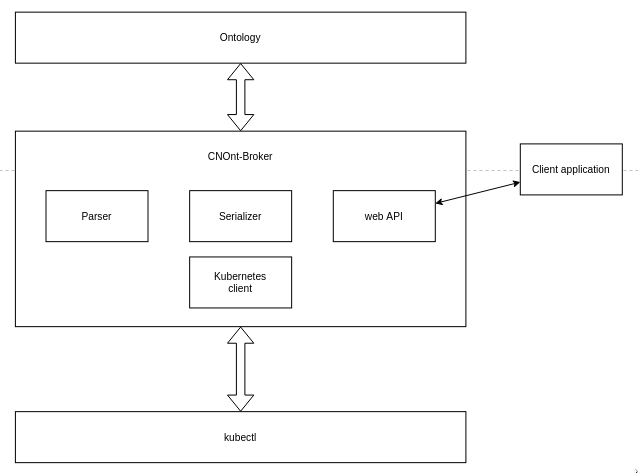

# __Overview__
CNOnt-Broker is a system which provides connection between cloud native ontology <br>
and Kubernetes cluster. Using Web Ontology Language (OWL) language. <br>
Application expose web API which is used by a client application. <br>



### __v1.0 version features__
- visualize ontology
- apply ontology to a Kubernetes cluster
- create ontology based on a Kubernetes cluster

### __How to run__

```
git clone https://github.com/greg9702/CNOnt-Broker.git
cd CNOnt-Broker
docker-compose up --build
```

If you would like to run directly on your machine run:
```
export GO111MODULE=on
cd core
go run main.go
```
Make sure to set _GO111MODULE_ to on. Without this issues with dependencies can occur.


#### __Cluster setup__
Install [kind](https://github.com/kubernetes-sigs/kind) -  tool for running local Kubernetes clusters using Docker container "nodes". <br>
If you have go (1.11+) and docker installed:
```
GO111MODULE="on" go get sigs.k8s.io/kind@v0.8.1
```
If you would like to have access to kind from your console run:
```
kubectl config use-context kind-<cluster name>
```
Set up cluster by running:
```
cd cluster
./setup.sh
```
You are ready to go!

File _cluster-config.yaml_ contains configuration for cluster. Visit [link](https://github.com/kubernetes-sigs/kind) for more details.

Script by default creates admin account, which access token can be obtained by running script _getadmintoken.sh_ in _cluster_ directory.

#### Kuberentes client API documentation

Documentation can be found [here](https://godoc.org/k8s.io/client-go/kubernetes).

#### Issues

According to https://github.com/kubernetes/kubeadm/issues/1292, there can occur bug where _corde-dns_ remains in _CrashLoopBackOff_ state.<br>
To fix this:
```
kubectl -n kube-system edit configmap coredns
```
Remove or comment out the line with loop, save and exit.
```
kubectl -n kube-system delete pod -l k8s-app=kube-dns
```

---

### __v1.0 ROADMAP__

__v0.1__
- [x] Add docker-compose
- [x] Communicate client and core application
- [x] Elaborate concept of the "top" ontology


__v0.2__
- [ ] Add cluster setup scripts
- [ ] Design and implement API
- [ ] Add config file
- [ ] Add parser to the project
- [ ] Add kubernetes client to the project
- [ ] Create MVP using kuberenets client and parser

__v0.4__
- [ ] Finish client application
